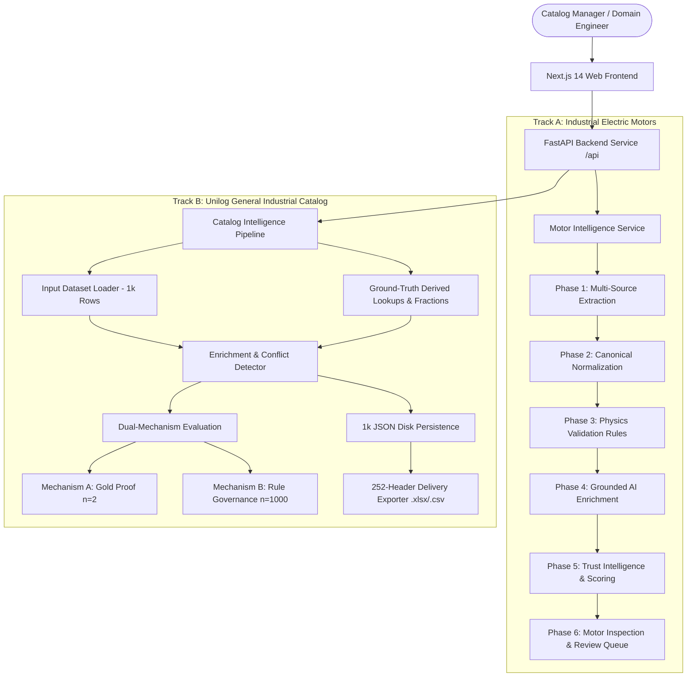

# ProductIQ System Architecture
## Comprehensive Architectural Design & Dual-Pipeline Engineering Guide

---

## 1. High-Level Architecture Overview

ProductIQ is engineered as an evidence-first, trust-aware product intelligence platform. It features a **Dual-Pipeline Architecture** that shares core principles of immutable provenance, zero-fabrication discipline, and explainable trust scoring across two distinct industrial domain targets:



---

## 2. Core Architectural Invariants

Across both pipelines, the system strictly enforces four architectural guarantees:

1. **Immutable Provenance (`EvidenceRecord`):** Every extracted value retains a reference to its source document, page, row, and exact original string.
2. **Strict 4-Tier Trust Status System:** Every field in the system is explicitly categorized:
   - `Verified`: Backed by authoritative source evidence or exact lookup match.
   - `Inferred`: Derived deterministically (e.g. fraction parsing) or synthesized by grounded LLM.
   - `Conflicted`: Disagreeing multi-source evidence (e.g. PDF 2.34 A vs CSV 7.22 A, or TREX vs Boise Cascade).
   - `Unknown`: Missing or outside verified reference coverage ($0.0$ confidence).
3. **Zero-Fabrication Principle:** When master reference lists or evidence are absent, values remain `Unknown` or genuinely empty cells. The system never invents plausible-looking data.
4. **No Silent Conflict Resolution:** Contradictory values are surfaced as `Conflicted` and routed to human review rather than being silently overridden.

---

## 3. Track A Architecture: Industrial Electric Motors (`productiq/`)

The motor intelligence pipeline processes multimodal technical datasheets (PDFs), legacy ERP catalog exports (CSVs), and web references through 6 completed phases:

```
PDF / CSV / Web Sources
          │
          ▼
┌────────────────────────────────────────────────────────┐
│ PHASE 1: EXTRACTION (PDFExtractor, CSVExtractor, Web)   │  ──► EvidenceRecord
└────────────────────────┬───────────────────────────────┘
                         ▼
┌────────────────────────────────────────────────────────┐
│ PHASE 2: NORMALIZATION (MotorNormalizer, UnitConverter) │  ──► Canonical Units (SI)
└────────────────────────┬───────────────────────────────┘
                         ▼
┌────────────────────────────────────────────────────────┐
│ PHASE 3: PHYSICS VALIDATION (MotorValidator, Rules)    │  ──► T = P*60 / 2*pi*N, Slip, IE3
└────────────────────────┬───────────────────────────────┘
                         ▼
┌────────────────────────────────────────────────────────┐
│ PHASE 4: GROUNDED AI ENRICHMENT (Groq/OpenAI Provider) │  ──► Descriptions & Apps
└────────────────────────┬───────────────────────────────┘
                         ▼
┌────────────────────────────────────────────────────────┐
│ PHASE 5: TRUST INTELLIGENCE (TrustEvaluator, Queue)    │  ──► S = 0.35C + 0.35V + 0.30D - P
└────────────────────────┬───────────────────────────────┘
                         ▼
┌────────────────────────────────────────────────────────┐
│ PHASE 6: PRESENTATION & REVIEW API (FastAPI Routes)    │  ──► /api/products, /api/reviews
└────────────────────────────────────────────────────────┘
```

---

## 4. Track B Architecture: Unilog Catalog Intelligence (`productiq_catalog/`)

The catalog pipeline is engineered for high-throughput batch normalization, conflict detection, and delivery format export across Unilog's 1,000-row sample dataset:

```
Unihack Input CSV (1,000 rows)
          │
          ▼
┌────────────────────────────────────────────────────────┐
│ 1. INGESTION & DATASET LOADER (InputDatasetLoader)     │  ──► CatalogInputRow
└────────────────────────┬───────────────────────────────┘
                         ▼
┌────────────────────────────────────────────────────────┐
│ 2. GROUND-TRUTH SOURCED LOOKUP DICTIONARIES            │
│    • ManufacturerBrandLookup (2 canonical pairs)       │
│    • UOMLookup (4 canonical units + aliases)           │
│    • DecimalFractionLookup (63 exact conversions)      │
└────────────────────────┬───────────────────────────────┘
                         ▼
┌────────────────────────────────────────────────────────┐
│ 3. CATALOG ENRICHMENT ENGINE (CatalogPipeline)         │
│    • ManufacturerEnricher (Canonicalization & Brand)   │
│    • UOMEnricher (Physical & Technical Triples)        │
│    • ConflictDetector (39.2% cross-column flagging)    │
│    • Description Synthesizer (Short / Long desc)       │
└────────────────────────┬───────────────────────────────┘
                         ▼
┌────────────────────────────────────────────────────────┐
│ 4. DUAL-MECHANISM EVALUATION FRAMEWORK                 │
│    • Mechanism A (ExactMatchEvaluator): Gold Proof n=2 │  ──► 100.0% Formatting Fidelity
│    • Mechanism B (ComplianceEvaluator): Scale n=1,000  │  ──► 100.0% LOV, 39.2% Conflict
└────────────────────────┬───────────────────────────────┘
                         ▼
┌────────────────────────────────────────────────────────┐
│ 5. EXACT-HEADER DELIVERY EXPORTER (.xlsx / .csv)       │
│    • 252 Canonical Headers Preserved in Order          │
│    • Genuinely Blank Unsupported Cells                 │
└────────────────────────────────────────────────────────┘
```

---

## 5. Backend Architecture & FastAPI API Structure

The backend application (`productiq.api.app:app`) mounts modular routers exposing both pipelines:

| Route Prefix | Module | Target Domain & Responsibility |
|---|---|---|
| `/api/products` | `productiq.api.routes` | Motor catalog listing, detailed specs, physics findings, trust scores |
| `/api/reviews` | `productiq.api.routes` | Motor conflict review queue & human-in-the-loop resolution |
| `/api/batch` | `productiq.api.routes` | Motor batch aggregation & publishability distribution |
| `/api/catalog/products` | `productiq_catalog.api.routes` | 1,000-row catalog explorer, search, status filters, product detail |
| `/api/catalog/lookups/*` | `productiq_catalog.api.routes` | Queries for manufacturer, UOM, and decimal-fraction dictionaries |
| `/api/catalog/eval/*` | `productiq_catalog.api.routes` | Live endpoints for Mechanism A (n=2) and Mechanism B (n=1,000) metrics |
| `/api/catalog/export/delivery-format` | `productiq_catalog.api.routes` | File download for 252-column `productiq_delivery_output.xlsx` and `.csv` |

---

## 6. Frontend Architecture (Next.js 14 App Router)

The frontend (`frontend/`) uses React Server and Client Components with TypeScript, Tailwind CSS, Lucide icons, and Recharts:

```
frontend/
├── app/
│   ├── page.tsx                     # Motor Intelligence Dashboard (Phase 6)
│   ├── products/                    # Motor Catalog & Product Detail
│   ├── reviews/                     # Motor Review Queue & Resolution Modal
│   ├── batch/                       # Motor Batch Analytics
│   ├── ingest/                      # Motor Ingestion Pipeline Trigger
│   └── catalog/                     # Catalog Intelligence Track (Unilog)
│       ├── page.tsx                 # Catalog Batch Dashboard & Live Metrics
│       ├── products/page.tsx        # 1,000 Items Explorer Table
│       ├── products/[id]/page.tsx   # Catalog Product Detail & Triples
│       ├── gold-standard/page.tsx   # Gold Standard Proof View (n=2)
│       └── eval/page.tsx            # Compliance & Scale Evaluation View
├── components/
│   ├── layout/                      # Sidebar & Header with Dual Navigation
│   └── ui/                          # TrustStatusBadge, MetricCard, Comparator, etc.
└── lib/
    ├── api.ts                       # Typed fetch client for /api and /api/catalog
    └── types.ts                     # TypeScript DTO interfaces
```
